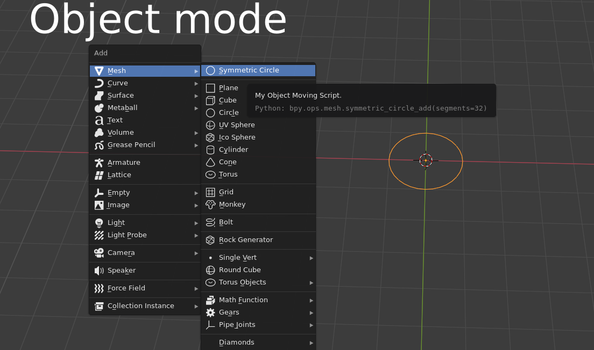

# Issue

The Blender don't allow creating symmetric circle primitives, see for details: https://developer.blender.org/T87779

# Overview

This is an add-on for Blender 3D which creating symmetric circle primitives. You can create circle primitives in object or edit modes call a context menu:

Also the addon allow do automatic calculation of optimal amount segments for the specified radius to its similarities to original radius when the circle uses with modifier Subdivision Surface. Additionally, threshold maximum tolerance truncation of radius can be to set when calculating auto segmentations.

Below shown differents diameters of cylinders but truncation of radius/diameter about the same after apply modifier Subdivision Surface in both cases with set threshold to 0.25 mm in the option for calculation of auto segmentation:

The option **has restrict** maximum to 1000 segments.

# Installation

1. Download the [latest release](https://github.com/microcoder/SymmetricPrimitives/releases/latest).

2. Run the Blender and go to the menu `Edit → Preferences → Add-ons` then click on `Install`:

3. Find and select the downloaded zip file, then click Install Add-on.

4. Enable the add-on toggle the checkbox in Add Mesh category.
